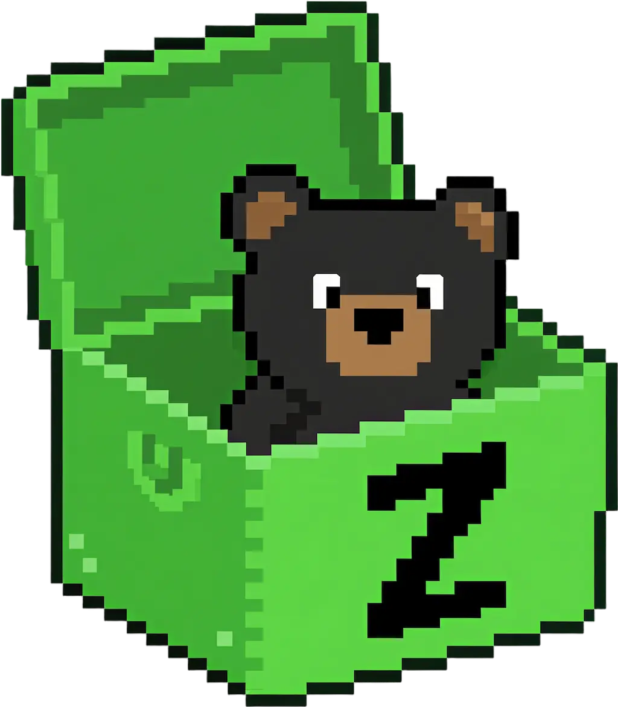

# ZenBox 

**Code React like Vue 💚, manage state like Zustand 🐻.**


## Vue + Zustand = React state bliss

### 🐻 Zustand's Simplicity

```ts
const counter = ZenBox({ count: 0 }); // Full TypeScript inference
```

### ⚡ Vue-like DX

```ts
const doubled = useComputed(() => 2 * counter.value.count);

useWatch(
  () => counter.value.count,
  (newV, oldV) => console.log("Changed!", newV, oldV)
);
```

### 🚀 Key Benefits

- **Minimal learning curve** - If you know Vue or Zustand, you know ZenBox
- **React optimized** - Built specifically for React's rendering model
- **TypeScript first​​​​**​​ – Fully inferred types , zero manual interfaces
- **​​Immer built-in**​​ – Mutate state naturally, no spread operators
- **Tiny Bundle**​​ – Core library under 100 lines, < 3KB gzipped

## Getting Started

> [!TIP]
> ✨ Launching soon - stay tuned!

```shell
npm install zenbox
```

## ZenBox vs Zustand

| Feature                | ZenBox                               | Zustand                      |
| ---------------------- | ------------------------------------ | ---------------------------- |
| **Simple API**         | ✅ One-line store creation           | ✅ Simple                    |
| **Vue-like DX**        | ✅ `useComputed`/`useWatch`          | ❌ Manual handling           |
| **TypeScript Support** | ✅ Full auto-inference               | ⚠️ Manual interface required |
| **State Mutation**     | ✅ Direct mutation (Vue-like)        | ❌ Manual `.get()`/`.set()`  |
| **Computed Values**    | ✅ Cross-store, auto-tracked         | ⚠️ Pre-combined              |
| **Store Scoping**      | ✅ Built-in Provider for local store | ❌ Global default            |
| **Immer Support**      | ✅ Out of the box                    | ⚠️ Plugin required           |
| **Learning Curve**     | ✅ Minimal (Vue-friendly)            | ✅ Low                       |

## License

MIT License © 2025-PRESENT [Del Wang](https://del.wang)
